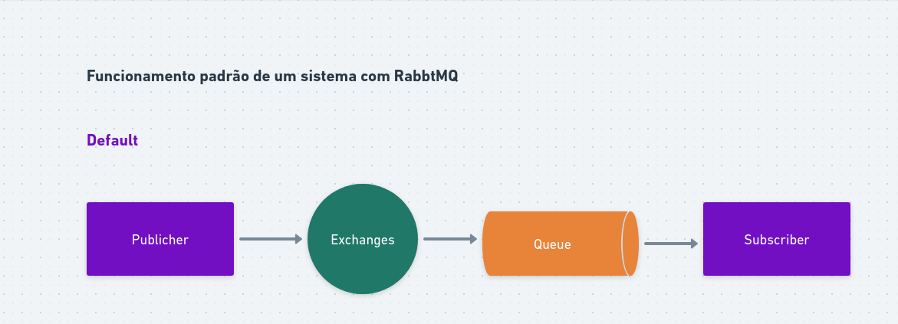
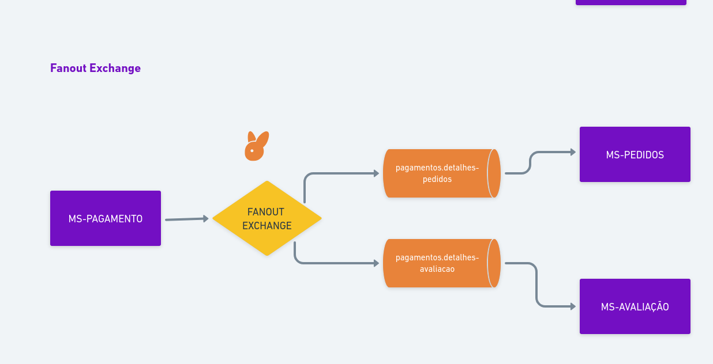

# ALURA_FOOD_RABBITMQ

## Link de documentações e recursos

* [RabbtMQ](https://docs.spring.io/spring-amqp/docs/current/api/)
* [Spring AMQP](https://spring.io/projects/spring-amqp#overview)
* [RabbitMQ simulator](https://tryrabbitmq.com/)

## Passo a passo para a configuração

1. Adicionar a dependência do protocolo AMQP
2. Configurar o arquivo de properties
3. Criar a classe de configuração AMQP

## Configuração default<br></br>



## Configuração Fanout exchenge<br></br>

* Neste exemplo os microsserviços que são consumidores vão ser responsáveis por criar as filas.
* O microsserviço produtor que criará a exchange

<br></br>


# RabbitMQ: Tipos de Exchanges

No RabbitMQ, as **exchanges** são componentes fundamentais responsáveis por rotear mensagens para as filas (**queues**)
com base em regras de roteamento. Este documento explica os **tipos de exchanges** disponíveis e seus casos de uso.

---

## 1. Direct Exchange

- **Descrição**: Roteia mensagens para filas com base em uma **chave de roteamento exata** (**routing key**).
- **Funcionamento**:
    - Cada mensagem possui uma chave de roteamento.
    - A mensagem será enviada para filas que tenham um **binding key** correspondente à chave de roteamento da mensagem.
- **Uso Comum**: Quando há necessidade de enviar mensagens diretamente para filas específicas.
- **Exemplo**:
    - Mensagem com chave `order_created` será roteada apenas para filas vinculadas com `order_created`.

---

## 2. Fanout Exchange

- **Descrição**: Roteia mensagens para **todas as filas vinculadas**, ignorando a chave de roteamento.
- **Funcionamento**:
    - Todas as filas associadas a essa exchange recebem uma cópia da mensagem.
    - Não utiliza chaves de roteamento.
- **Uso Comum**: Transmissão de mensagens para várias filas simultaneamente, como notificações ou eventos que precisam
  ser processados por diferentes consumidores.
- **Exemplo**:
    - Uma notificação de atualização de status pode ser enviada para todas as filas associadas a essa exchange.

---

## 3. Topic Exchange

- **Descrição**: Roteia mensagens com base em **padrões de chave de roteamento** que utilizam curingas (`*` e `#`).
- **Funcionamento**:
    - `*`: Corresponde a exatamente **uma palavra**.
    - `#`: Corresponde a **zero ou mais palavras**.
    - As filas são vinculadas com padrões e recebem mensagens que correspondem ao padrão.
- **Uso Comum**: Quando há necessidade de roteamento dinâmico e complexo.
- **Exemplo**:
    - Chave `log.info` pode ser roteada para uma fila vinculada ao padrão `log.*`.
    - Chave `log.error.database` pode ser roteada para uma fila vinculada ao padrão `log.#`.

---

## 4. Headers Exchange

- **Descrição**: Roteia mensagens com base nos **headers** das mensagens, ao invés da chave de roteamento.
- **Funcionamento**:
    - As mensagens contêm cabeçalhos com pares chave-valor.
    - As filas são vinculadas com base nos valores desses cabeçalhos.
    - Pode ser configurado para "match all" (todas as condições) ou "match any" (qualquer condição).
- **Uso Comum**: Quando o roteamento depende de atributos arbitrários que não são cobertos por chaves de roteamento.
- **Exemplo**:
    - Cabeçalho `{type: "pdf", format: "A4"}` pode ser roteado para uma fila vinculada a essas condições.

---

## Comparação Resumida

| Tipo        | Roteamento Baseado em... | Exemplo de Uso                        |
|-------------|--------------------------|---------------------------------------|
| **Direct**  | Chave de Roteamento      | Mensagem para uma fila específica.    |
| **Fanout**  | Transmissão Geral        | Broadcasting de eventos/notificações. |
| **Topic**   | Padrões de Chave         | Logs categorizados (`log.*`).         |
| **Headers** | Cabeçalhos da Mensagem   | Requisitos complexos por atributos.   |

---

## Referências

- [Documentação Oficial RabbitMQ](https://www.rabbitmq.com/documentation.html)
- [Tutorial RabbitMQ Exchanges](https://www.rabbitmq.com/tutorials/tutorial-three-python.html)

## Possíveis erros com RabbitMQ

* Se por algum motivo acontecer algum erro pelo meio do caminho e a aplicação lançar uma excessão , o sistema acaba
  ficando em looping pois ele não sabe como resolver o problema e fica tentando sempre fazer um novo consumo da fila.
* A solução para esse caso é limitar o número de tentativas e caso o erro persista o Rabbitmq pule para a próxima
  mensagem.

### Configurando o arquivo de properties para lidar com falhas

```properties
spring.rabbitmq.listener.simple.retry.enabled=true
spring.rabbitmq.listener.simple.retry.max-attempts=4
```

## O que é DLQ (Dead Letter Queues)?

DLQ (Dead Letter Queue) em RabbitMQ é uma fila especial usada para armazenar mensagens que não puderam ser entregues ou
processadas corretamente por alguma razão. Essas mensagens são chamadas de "dead letters" (cartas mortas). A DLQ é útil
para diagnosticar e resolver problemas de mensagens que falharam, garantindo que você não perca informações importantes.


